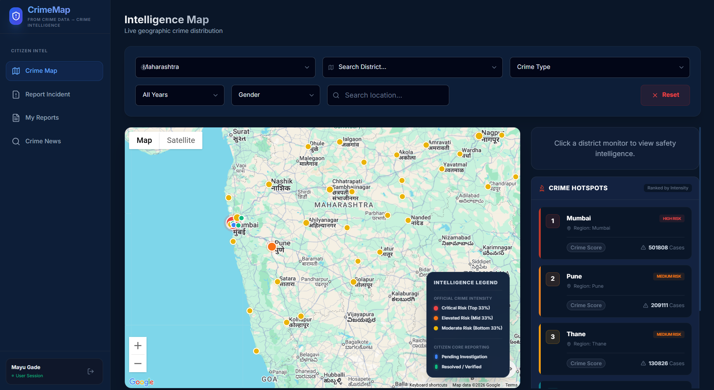
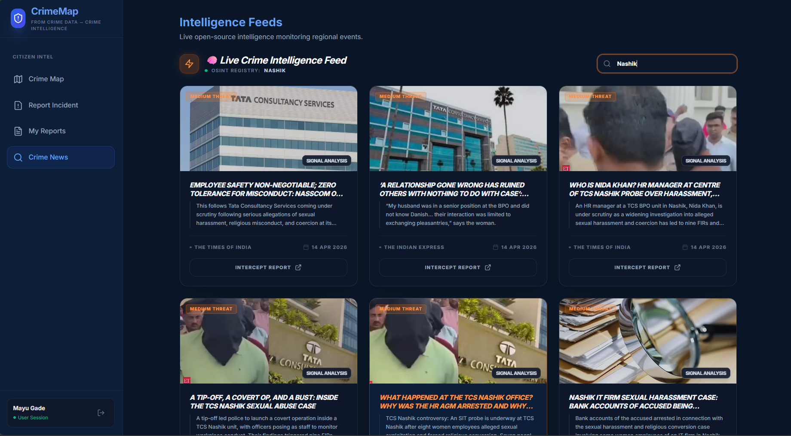

# 🗺️ CrimeMap AI
### National Crime Intelligence & Decision Support System
*Built for Hackathon 2026 — Turning Data into Defenses.*
*Crafted with passion by **Team CodeCrust***

---

CrimeMap AI transforms fragmented regional crime data into a live, actionable safety intelligence grid. Designed for both law enforcement and everyday citizens, it fuses open-source intelligence, interactive heatmap visualization, and a verified citizen reporting pipeline into a single decision-ready platform.

---

## ✨ Key Highlights

| | Feature | Description |
|---|---|---|
| 📡 | **Live OSINT Intelligence** | Real-time crime feed classified by severity, sourced from verified national outlets |
| 🌐 | **Interactive Heatmap** | National crime density visualization with district-level drill-down analytics |
| 🙋 | **Citizen Reporting** | Secure incident submission with full admin verification and moderation pipeline |
| ⚙️ | **Full-Stack Architecture** | FastAPI backend + React frontend, JWT-secured, production-ready |

---
## Screenshots

### 🗺️ Crime Heatmap


### 🧠 Intelligence Feed


---

## 🔍 Core Features

### 📡 OSINT Intelligence Layer
The platform ingests live news signals and classifies them automatically before they ever reach a user's screen.

- **Real-time severity classification** — incidents are tagged `High / Medium / Low` using pattern-based NLP markers
- **Source credibility scoring** — distinguishes verified OSINT (trusted national outlets) from unverified signal noise
- **Intelligent caching** — 5-minute TTL cache protects API rate limits and ensures sub-second responsiveness

> **Note:** News data is powered by NewsAPI (free tier). High-frequency usage may encounter rate limits.

### 🗺️ Heatmap & Trend Analysis
- **Dynamic hotspot detection** — crime density rendered across states and districts in real time
- **Decision support overlays** — highlights "Actionable Intelligence Zones" and "Community Gap Alerts"
- **Regional benchmarking** — compare safety scores between states (e.g., Maharashtra vs Delhi) using historical crime patterns

### 🙋 Citizen Intelligence Desk
- **Secure incident reporting** — authenticated portal for citizens to submit and track reports
- **Admin moderation pipeline** — full complaint lifecycle management: intake → verification → resolution
- **Privacy-first design** — unverified or rejected reports are strictly filtered from public-facing views

---

## 🛠️ Tech Stack

| Layer | Technology |
|---|---|
| **Frontend** | React 18, Vite, Tailwind CSS, Lucide Icons, Axios |
| **Backend** | FastAPI (Python), Uvicorn, Python-Multipart |
| **Auth & Security** | JWT Authentication, PBKDF2 Password Hashing (Passlib) |
| **Data Engine** | Pandas — regional aggregation and analytical compute |

---

## 🚀 Getting Started

### Prerequisites
- Node.js v18 or higher
- Python 3.10 or higher

### Backend Setup

```bash
# 1. Navigate to the backend directory
cd backend

# 2. Create and activate a virtual environment
python -m venv venv
source venv/bin/activate        # Windows: venv\Scripts\activate

# 3. Install dependencies
pip install -r requirements.txt

# 4. Configure environment variables
cp .env.example .env
# Edit .env and fill in your values:
#   NEWS_API_KEY=your_newsapi_key_here
#   JWT_SECRET=your_jwt_secret_here

# 5. Start the development server
python -m uvicorn app.main:app --reload
```

Backend will be live at `http://localhost:8000`

### Frontend Setup

```bash
# 1. Navigate to the frontend directory
cd frontend

# 2. Install dependencies
npm install

# 3. Start the development server
npm run dev
```

Frontend will be live at `http://localhost:5173`

---

## 📖 Usage Guide

### 👤 Citizen Flow
1. Register or log in as a standard user
2. **Explore the Intelligence Feed** — browse live OSINT-classified crime reports filtered to your region
3. **Check the Safety Map** — view verified hotspots and safe zones on the interactive heatmap
4. **Submit a report** via the Reporting Desk and track its verification status under *My Reports*

### 🔐 Admin / Law Enforcement Flow
1. Log in using specialized admin credentials
2. **Access the Intelligence Desk** — review, verify, or reject incoming citizen reports
3. **Analyze Data Insights** — identify rising crime trends, resource gaps, and emerging hotspot clusters

---

## 👥 Team

**Team CodeCrust — Hackathon 2026**

| Name | GitHub |
|---|---|
| Shreya Nipunge | [@shreyanipunge](https://github.com/Shreya-nipunge) |
| Kirtan Devadiga | [@kirtandevadiga](https://github.com/Kirtan-pc) |
| Mayuri Gade | [@mayurigade](https://github.com/mayurigade-hub) |
| Shreya Dandekar | [@shreyadandekar](https://github.com/shreyadandekar) |
| Lata Choudhary | [@latachoudhary](https://github.com/latachoudhary18) |

---

## 📄 License

This project is licensed under the **MIT License** — see the [LICENSE](./LICENSE) file for details.
